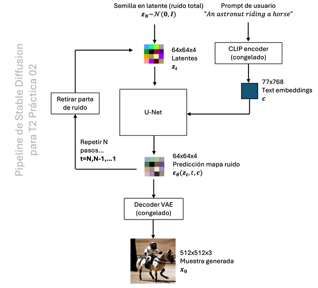

# Latent Diffusion Models (LDM) with Hugging Face Diffusers

  

## Introduction
This project is a hands-on guide to understanding and **rebuilding step by step** the *pipeline* of **Latent Diffusion Models (LDM)** using the **Hugging Face Diffusers** library.  
We use **Stable Diffusion v1.4** as a case study — breaking down its main components (VAE, U-Net, CLIP text encoder), implementing the *denoising loop* in **latent space**, comparing multiple *sampling schedulers* (including **DDIM**, **PNDM**, **DPM++**, **UniPC**), and evaluating text–image alignment with **CLIPScore**.

**Reference Papers**
- [High-Resolution Image Synthesis with Latent Diffusion Models](https://arxiv.org/abs/2112.10752) — *Rombach et al., 2022*  
- [Stable Diffusion v1.4](https://huggingface.co/CompVis/stable-diffusion-v1-4) — *CompVis / Stability AI / LAION*  
- [Denoising Diffusion Implicit Models (DDIM)](https://arxiv.org/abs/2010.02502) — *Song et al., 2020*

## Learning Objectives
- Understand why **latent diffusion** is faster and more memory-efficient than pixel-space diffusion.  
- Explore the three core components of Stable Diffusion:
  - **VAE (AutoencoderKL)** — compresses and decodes image representations.
  - **U-Net 2D Conditional Model** — predicts noise using *cross-attention*.
  - **Text Encoder (CLIP ViT-L/14)** — provides semantic conditioning from text prompts.  
- Implement the **denoising loop** in latent space with *Classifier-Free Guidance (CFG)*.  
- Compare **sampling schedulers**: DDIM, PNDM, DPM++ 2M Karras, UniPC.  
- Compute **CLIPScore** to evaluate text–image semantic alignment.  
- Analyze **VRAM usage**, **model size**, precision modes (**fp32/fp16/bf16**), and runtime performance.

## Technologies Used
- **PyTorch**
- **Hugging Face Diffusers**
- **Transformers**
- **Torchvision / Datasets**
- **Matplotlib / PIL**
- **tqdm**

## Install the required dependencies:
  pip install -U diffusers transformers accelerate ftfy scipy datasets torchvision pyarrow matplotlib pillow tqdm

  ## Repository Structure

- `Jupyternotebook.ipynb` → main notebook with the full workflow.  
- `LDM_img.png` → illustration of the laten diffusion process.  
